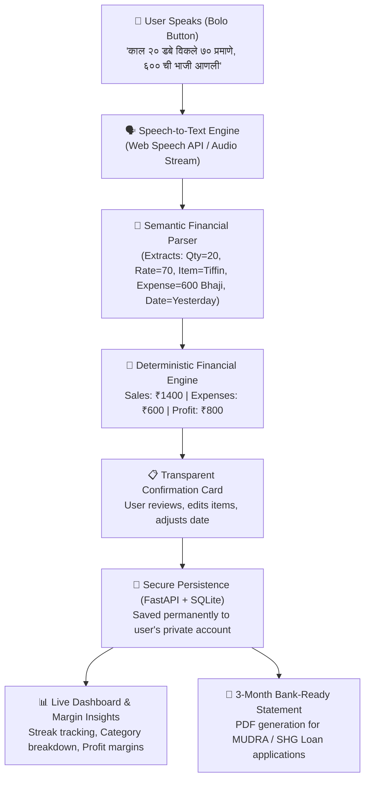

# Khata se Credit Tak (खाता से क्रेडिट तक)
> **"Speak. Understand. Grow."** — *From daily spoken records to formal financial credit readiness.*  
> **Built by Team RootAccess · SHE SOLVES 3.0 Hackathon**

[](https://github.com/yvaishnavi054-web/she_solves)
[](https://github.com/yvaishnavi054-web/she_solves)
[](https://github.com/yvaishnavi054-web/she_solves)
[](https://github.com/yvaishnavi054-web/she_solves)

### 🌐 Project Repository
* **GitHub Repository:** [https://github.com/yvaishnavi054-web/she_solves](https://github.com/yvaishnavi054-web/she_solves)
* **Frontend:** React 19 + TypeScript + Vite 8 + Tailwind CSS v4 + Web Speech API (STT/TTS)
* **Backend:** FastAPI + Python + SQLite + SQLAlchemy + Google Gemini 1.5 Flash + Meta WhatsApp Cloud API

---

## 🌟 Executive Summary

**Khata se Credit Tak** is an AI-powered, voice-first bookkeeping and credit-readiness platform tailored for women nano- and micro-entrepreneurs across India. It bridges the critical divide between **informal, unorganized memory-based business records** and **formal banking credit eligibility**.

By allowing entrepreneurs to speak their daily transactions naturally in **Marathi (मराठी)**, **Hindi (हिंदी)**, or **English**, the system automatically extracts itemized income and expenses, computes net profit with deterministic mathematical accuracy, tracks customer credit (Udhaar) with WhatsApp reminders, and compiles transaction histories into a **3-Month Bank-Ready Financial Statement** for government schemes like **MUDRA**, **Stand-Up India**, and **SHG loans**.

---

## 🔍 The Problem & The Critical Gap We Resolve

### The Problem
* **The "Mental Diary" Trap:** Over 80% of nano-entrepreneurs (tiffin providers, home bakers, tailors, salon owners, street vendors) do not maintain written books. They rely on memory or paper chits that get lost.
* **Typing & Language Barriers:** Existing accounting software (e.g., Tally, Zoho, Vyapar) requires complex numeric entry, accounting jargon (debit/credit), and typing, which intimidates semi-literate or non-English-speaking entrepreneurs.
* **Invisible Cash Flow:** Because cash comes in and immediately goes out for groceries or family expenses, business owners cannot answer fundamental questions: *"Am I actually making a profit?"* or *"Which product gives me the highest margin?"*
* **Credit Invisibility & Loan Rejections:** When approaching formal banks or Self-Help Groups (SHGs) for business expansion loans, applicants are rejected due to a lack of documented financial track records. They are forced to borrow from local moneylenders at crippling interest rates (30–60% p.a.).

### The Gap We Resolve
| The Traditional Gap | How Khata se Credit Tak Resolves It |
| :--- | :--- |
| **Typing & Complexity** | **Zero Typing Required:** Speak naturally in regional dialect (Marathi, Hindi, English). |
| **Hallucinating AI Calculations** | **Hybrid Deterministic Engine:** NLP extracts structured entities, but all arithmetic (totals, profit, margins) is computed deterministically in code—guaranteeing 100% financial accuracy. |
| **Backdated Entry Inflexibility** | **Spoken & Calendar Date Recognition:** Recognizes spoken relative dates (*"काल" / "कल" / "yesterday"* or calendar dates) and allows 1-click date changes before saving. |
| **Ignored Customer Udhaar** | **Active Customer Credit Tracking:** Track who owes how much, log partial repayments, and send polite, pre-filled WhatsApp reminder messages in 1 click. |
| **No Proof for Bank Officers** | **Formal 3-Month Bank-Ready Statement:** Automatically transforms daily micro-entries into a structured monthly cash-flow statement formatted specifically for bank and SHG loan officers. |

---

## 🚀 What New We Did (Key Innovations)

1. **Trilingual Voice-First Financial Parser:**
   * Understands spoken conversational Marathi, Hindi, and English (e.g., *"आज २० डबे विकले ७० प्रमाणे. ६०० रुपयांची भाजी आणि ४५० रुपयांचा गहू आणला"*).
   * Automatically isolates multiple transactions from a single spoken sentence into distinct Sales and itemized Expenses.
2. **Deterministic Arithmetic (No AI Hallucinations):**
   * Eliminates the danger of LLMs calculating incorrect sums. Unit prices, quantities, and totals are computed strictly with validated mathematical logic.
3. **Natural Spoken & Manual Backdated Entries:**
   * Spoken time indicators (*"काल"*, *"परवा"*, *"yesterday"*, specific dates) are parsed automatically into past dates.
   * Users can select previous dates directly on the Confirmation Card or through a dedicated modal on the Ledger page.
4. **Dynamic Trade Profiles + Custom Business Registration:**
   * Context-aware adaptations for Tiffin Services, Tailoring & Boutiques, Home Bakeries, Beauty Parlours, and Handicrafts.
   * If a user's business is not listed, they can select **"Other (इतर व्यवसाय)"** during signup to define their own trade (e.g., Dairy, Poultry, Kirana Store), ensuring customized categories and examples.
5. **Customer Udhaar Khata with WhatsApp Reminders:**
   * Digital ledger for customer credit with payment histories.
   * 1-click WhatsApp button generating polite reminder messages formatted in the user's selected language.
6. **Multi-Tenant Account Security & Persistence:**
   * Backed by FastAPI, SQLAlchemy, and SQLite with secure password hashing and JWT authentication.
   * Strictly isolates each user's financial ledger, ensuring newly created accounts start fresh without data leaks.

---

## 🛠️ Step-by-Step Workflow & System Architecture



### Detailed Steps:
1. **Tap "Bolo" (बोलण्यासाठी दाबा):**
   * The user clicks the microphone and speaks their day's earnings and costs in Marathi, Hindi, or English.
2. **Recognition & Semantic Entity Extraction:**
   * The audio transcript is processed to extract quantities, items, unit prices, expense categories, and dates.
3. **Deterministic Math Calculation:**
   * The engine computes:
     $$\text{Total Income} = \sum (\text{Qty} \times \text{Unit Price})$$
     $$\text{Total Expenses} = \sum (\text{Itemized Expenses})$$
     $$\text{Net Profit} = \text{Total Income} - \text{Total Expenses}$$
4. **Confirmation & Verification Card:**
   * Before anything is committed to the ledger, the user reviews a summary card displaying Income, Expenses, and Profit.
   * The user can edit values, add items, or change the transaction date.
5. **Ledger & Dashboard Updates:**
   * Once confirmed, records update the real-time financial metrics, daily streak, and visual trends.
6. **Credit-Readiness & Loan Scheme Guidance:**
   * The user can view their record consistency strength, check eligibility for government schemes (PMMY Mudra, Stand-Up India, PM SVANidhi), and export a bank-compliant statement.

---

## 📱 Core Modules & Features

### 1. Dashboard & Streak Tracker
* **Real-time Metrics:** Today's sales, expenses, and net profit computed dynamically.
* **Daily Streak Tracker:** Encourages consistent record-keeping; consistent records build credibility with lending institutions.
* **Language Switcher:** Instant, seamless switching across Marathi, Hindi, and English for all interface elements.

### 2. Voice Khata
* **Live Listening Animation:** Clear audio feedback with sound toggle.
* **Confirmation Dialog:** Shows *"What you said"* alongside diagnosed income, expenses, and net profit.
* **Manual Entry Alternative:** Built-in typing fallback with date picker for users who prefer text input.

### 3. Business Ledger (खतावणी)
* **Search & Filter:** Search by customer, item, date, or category; filter by income or expenses.
* **Backdated Entries:** Dedicated `+ Add Entry (मागील तारीखही निवडा)` modal for recording past transactions.
* **Full CRUD Support:** Edit or delete any entry with immediate recalculation.

### 4. Udhaar Khata (Customer Credit Ledger)
* **Customer Balance Tracking:** Track total credit, partial repayments, and pending balances.
* **Sample Reference Entry:** Features a clean sample entry for guidance while keeping custom records strictly user-specific.
* **WhatsApp Integration:** Generates WhatsApp links (`wa.me`) with pre-filled reminder texts in Marathi, Hindi, or English.

### 5. Profit & Margin Insights
* **Item-Specific Margin Calculator:** Identifies which products yield the highest returns.
* **Expense Breakdown:** Categorizes operational costs (Groceries, Utilities, Raw Material, Supplies) to pinpoint cash leaks.

### 6. Credit Readiness & Bank Statement
* **Objective Record Strength:** Measures transaction completeness and recording regularity (not a credit score; no false promises).
* **Bank-Ready PDF Statement:** Exports clean, professional cash-flow documentation suitable for bank managers and SHG audits.
* **Government Schemes Directory:** Direct links and documentation checklists for **PMMY (Mudra)**, **Stand-Up India**, **PM SVANidhi**, **PMEGP**, and **Lakhpati Didi**.

---

## 💻 Tech Stack

| Layer | Technologies Used |
| :--- | :--- |
| **Frontend** | React 18, TypeScript, Tailwind CSS, Vite, Framer Motion, Lucide Icons, Recharts |
| **Backend** | Python 3.12, FastAPI, SQLAlchemy, SQLite, Uvicorn |
| **Authentication** | PyJWT (HMAC-SHA256), Passlib (PBKDF2-SHA256), OAuth2 Bearer Tokens |
| **Speech & NLP** | Web Speech API, Regex Entity Matchers, Google Gemini API (optional hybrid parser) |
| **Export & Sharing** | jsPDF, html2canvas, WhatsApp Universal Click-to-Chat API |

---

## ⚙️ Local Setup & Installation

### Prerequisites
* **Node.js** (v18 or higher) & **npm**
* **Python** (v3.10 or higher) & **pip**
* **Git**

### 1. Clone the Repository
```bash
git clone https://github.com/yvaishnavi054-web/khata-se-credit-tak.git
cd khata-se-credit-tak
```

### 2. Backend Setup
```bash
# Navigate to backend directory
cd backend

# Create and activate virtual environment
python -m venv venv
# On Windows:
.\venv\Scripts\activate
# On Linux/macOS:
source venv/bin/activate

# Install dependencies
pip install -r requirements.txt

# Start the FastAPI server
uvicorn main:app --host 127.0.0.1 --port 8000 --reload
```
*The backend API will run at `http://127.0.0.1:8000` with interactive Swagger docs at `http://127.0.0.1:8000/docs`.*

### 3. Frontend Setup
Open a new terminal window:
```bash
# Navigate to frontend directory
cd frontend

# Install npm dependencies
npm install

# Start the Vite development server
npm run dev
```
*Open your browser and navigate to `http://127.0.0.1:5173`.*

---

## 🛡️ Security, Privacy & Ethical AI

* **Data Isolation:** User accounts and transactions are isolated using foreign keys and authenticated token scopes.
* **No AI Hallucinations for Math:** Deterministic code handles arithmetic; generative AI is strictly constrained to entity extraction.
* **Responsible Lending Disclaimers:** The platform clearly states that it is a bookkeeping and credit-readiness tool, not an official credit score or guaranteed loan approval system.

---

## 👥 Team RootAccess
* **She Solves 3.0 Hackathon Entry**
* Dedicated to empowering women entrepreneurs through accessible, voice-first digital public infrastructure.
